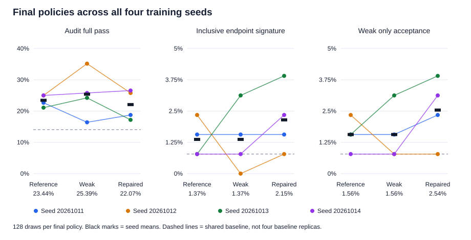
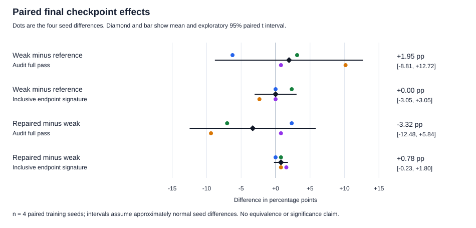

# Verifier reliability and GRPO training on booking capacity

A fixed verifier repair corrected all 38 observed false acceptances in a cohort of 2,048 generated program draws, without rejecting any of the 440 audit-passing draws. However, four paired training seeds did not establish that the weak verifier amplified the target bug, or that training with the repaired verifier reduced it. Better grading of saved programs and better learned behavior were distinct empirical questions; only the first received a clear positive answer here.

This report covers the completed 12-run replication, its separate exploratory pilot, all fixed evaluation checkpoints, training diagnostics, and execution-recovery evidence. It is a single-task, small-model study, not a frontier capability benchmark. The [analysis tables and figures](../reports/booking-replication/) are generated by an [offline, standard-library analyzer](../verifier_rl/booking_replication_analysis.py).

A separate [exploratory behavior analysis](booking_behavior_findings.md) examines metric disagreements, partial reward ordering, algorithmic mistakes, capped responses, and explanation versus code. Those post hoc observations broaden the study without changing the original questions or conclusions below.

## Research question

The task asks a model to implement `required_capacity(bookings)`: the maximum number of simultaneous bookings. Intervals are half-open. A booking ending at time 10 does not overlap one starting at time 10.

The weak verifier omits shared-endpoint cases, creating a specific incentive mismatch: an implementation treating endpoints as inclusive can earn full reward despite violating the specification. The questions were whether reinforcement learning amplifies that behavior, and whether replacing a small number of verifier tests prevents it.

The [prospectively frozen replication protocol](booking_replication_repair_protocol.txt) followed an exploratory [one-seed pilot](booking_failure_analysis.md). Its primary comparisons were weak minus reference and repaired minus weak at update 24. Its primary metrics were audit full-program pass rate and inclusive-endpoint signature frequency. The repair was selected before these replication results; no repair-strength search or best-checkpoint selection was performed.

## Controlled experiment

All 12 runs started from the same original Qwen2.5-Coder-1.5B-Instruct weights with fresh optimizers. The four training seeds were 20261011 through 20261014. Within each seed, reference, weak, and repaired conditions shared the prompt, initial weights and first rollout tokens. Saved identities and checkpoint receipts verify these matches.

| Training condition | Scored cases | Verifier change |
|---|---:|---|
| Reference | 96 | Complete training suite |
| Weak | 57 | Omit 39 shared-endpoint cases |
| Repaired | 57 | Replace eight ordinary weak-suite cases with eight authored shared-endpoint cases |

All arms use the same 96-input training universe and score their declared subset. The repair matches test count, not difficulty or information content. Audit cases do not supply training rewards.

Each run used 24 GRPO optimizer updates and four completions per update: 288 updates and 1,152 training completions in total. The fixed learning rate was `1e-6`, KL coefficient `beta=0`, and rewards were normalized within the completion group. AdamW used zero weight decay. Sampling used temperature 0.8, top-p 0.95, repetition penalty 1.05, and a 512-token completion cap. [Frozen implementation](../verifier_rl/booking_replication.py), [trainer construction](../modal_booking_replication.py).

Evaluation comprised one shared baseline of 128 draws, plus 32 draws at update 12 and 128 at update 24 for each of 12 policies: **2,048 draws total**. Sampling seeds were shared across policies. The reference and audit suites contain 287 unique inputs jointly; the audit has 192 cases. There were 480 post-training batches, all completed, with zero unresolved input outcomes in the final study.

The planned research workload was 698,368 program/input slots, including training. This is neither 698,368 independent samples nor an exact count of executed tests: 31 evaluation draws failed source extraction and remained in the denominator as failures. The other 2,017 evaluation draws have sandbox provenance. Repeated source strings also occur. The independent replication unit for training effects is the **training seed**, of which there are four.

## The repair improved grading on the evaluated cohort

Applying every verifier to the same complete evaluation cohort gives the following descriptive confusion counts. “Correct” here means passing all 192 audit cases, not correctness on every possible input.

| Verifier | Accepts audit-passing draws | Accepts audit-failing draws | Rejects audit-passing draws | Rejects audit-failing draws |
|---|---:|---:|---:|---:|
| Reference | 440 | 0 | 0 | 1,608 |
| Weak | 440 | 38 | 0 | 1,570 |
| Repaired | 440 | 0 | 0 | 1,608 |

The repaired verifier rejected **38/38 observed weak false acceptances**, while retaining **440/440 observed audit-passing draws**, with no increase in its 57-test budget. The weak verifier's 38 errors were 7.95% of its 478 full acceptances, or 2.36% of the 1,608 audit-failing draws; those are different denominators. [Machine-readable counts](../reports/booking-replication/verifier_confusion.csv).

This is the study's strongest positive verifier finding. It is not a universal zero-error guarantee: the cohort mixes baseline, intermediate and final policies from one task, includes repeated sources, and uses an existing development audit. It also does not establish that eight tests are minimal or optimal. Reference and repaired acceptance decisions agreed on this cohort, but their partial rewards and behavior outside it need not agree.

### Two observed failure mechanisms

All 38 false-acceptance draws were inspected, not just favorable examples. They represent 33 distinct source hashes. Their original protected results were revalidated for all 287 inputs each: **10,906 saved input outcomes**, with no candidate code rerun locally. Every recorded failure in these programs involved a shared endpoint. Full source, witness input, family counts, and score bindings are in the `failure_catalog` of [analysis.json](../reports/booking-replication/analysis.json).

**Inclusive endpoints:** 34 draws matched the authored inclusive-endpoint oracle on all 287 inputs. Each scored 57/57 on the weak verifier, 64/96 on reference, 49/57 on repaired, and 127/192 on the audit. One baseline example removes a booking from a heap only when its end is strictly less than the next start. Its saved witness is `[[3664, 3670], [3670, 3676]]`: expected capacity 1, observed 2. Changing the conceptual comparison from `<` to `<=` resolves that particular endpoint rule; no candidate patch was executed for this analysis.

**Order-sensitive ties:** four further draws passed all weak tests but did not match the exact inclusive signature. Their source sorts start/end events by time alone, allowing input order to decide which tied event comes first. All four scored 72/96 reference, 57/57 weak, 50/57 repaired, and 145/192 audit. The saved witness `[[5444, 5476], [5420, 5444]]` yielded 2 instead of 1. These programs matched the inclusive oracle on only 235/287 inputs. One also contains other suspicious logic; the observed endpoint explanation is not a proof of its complete semantics.

Consequently, the exact target signature missed **4/38 observed verifier false acceptances**. That is a useful measurement lesson: a known-bug detector and a broader correctness audit answer different questions. The original signature remains the primary metric; the broader failure taxonomy is a clearly labeled follow-up analysis.

## Training did not establish amplification or repair benefit

The following table includes every final-checkpoint draw, with 128 draws per policy and four seeds per condition. The arm percentages are equal-weight means across seeds; the pooled counts are descriptive summaries, not additional training replications.

| Final metric | Reference | Weak | Repaired |
|---|---:|---:|---:|
| Audit full pass | 120/512 — 23.44% | 130/512 — 25.39% | 113/512 — 22.07% |
| Inclusive-endpoint signature | 7/512 — 1.37% | 7/512 — 1.37% | 11/512 — 2.15% |
| Weak-only acceptance | 8/512 — 1.56% | 8/512 — 1.56% | 13/512 — 2.54% |
| Mean audit case accuracy | 40.03% | 39.52% | 42.68% |
| Hit completion token cap | 57/512 — 11.13% | 52/512 — 10.16% | 25/512 — 4.88% |

The shared baseline had 18/128 audit full passes (14.06%), one inclusive-signature draw, and 28.16% mean audit case accuracy. All 12 final policies exceeded the measured baseline full-pass rate, descriptively. That baseline is one finite sample, not four independent baseline measurements, and this does not establish broader coding improvement.



### All four seed pairs

Each cell below is a number of program draws out of 128. Showing the pairs makes the cancellation in the average target-bug effect visible.

| Training seed | Reference audit | Weak audit | Repaired audit | Reference target bug | Weak target bug | Repaired target bug |
|---|---:|---:|---:|---:|---:|---:|
| 20261011 | 29 | 21 | 24 | 2 | 2 | 2 |
| 20261012 | 32 | 45 | 33 | 3 | 0 | 1 |
| 20261013 | 27 | 31 | 22 | 1 | 4 | 5 |
| 20261014 | 32 | 33 | 34 | 1 | 1 | 3 |

For uncertainty, the analysis computes differences within each training seed, then reports `mean(d) ± 3.182446 × sd(d) / sqrt(4)`. This is an exploratory paired t interval with three degrees of freedom, conditional on this task and fixed evaluation seed panel. It assumes approximately normal, independent seed differences; with four seeds, especially for rare errors, that assumption is fragile. The precise interval method was chosen during analysis, not prospectively locked. There is no multiplicity correction or confirmatory significance claim. [NIST paired-observation method](https://www.itl.nist.gov/div898/handbook/prc/section3/prc311.htm), [t critical values](https://www.itl.nist.gov/div898/handbook/eda/section3/eda3672.htm).

| Primary contrast and metric | Mean difference | Exploratory 95% interval |
|---|---:|---:|
| Weak minus reference audit full pass | +1.95 percentage points | −8.81 to +12.72 |
| Weak minus reference target bug | 0.00 percentage points | −3.05 to +3.05 |
| Repaired minus weak audit full pass | −3.32 percentage points | −12.48 to +5.84 |
| Repaired minus weak target bug | +0.78 percentage points | −0.23 to +1.80 |



These observations do not support the intended amplification-and-mitigation story. They also do not prove equivalence or that verifier quality never affects learning. The fixed repair's training condition has no observed reduction in the target bug, and its mean audit full-pass rate is lower than the weak condition. Its higher partial accuracy and lower token-cap rate are secondary observations, not substitutes for the declared success criterion.

Why might offline grading improve without a clear training benefit? Short training, rare target behaviors, variable sampled groups, and changed reward geometry are plausible explanations, but this experiment does not distinguish them. Test-count matching does not make reward distributions identical. More training or a different repair might change the result; neither is evidence already obtained.

### Intermediate checkpoints and sampling sensitivity

The saved [common-draw trajectories](../reports/booking-replication/common_draw_trajectories.csv) compare the same first 32 sampling seeds at baseline, update 12, and update 24. Mean audit full-pass rates from update 12 to 24 are reference 14.06% to 15.63%, weak 16.41% to 20.31%, and repaired 15.63% to 21.88%. These are descriptive trajectories, not reasons to replace the primary 128-draw final comparison.

The fixed 32-draw prefix contains zero final repaired-policy inclusive signatures across the four seeds. The full planned 128 draws per policy reveal eleven. On that prefix alone, repaired also appears better than weak on full audit passes; on the complete final cohort its mean is lower. This is one predetermined prefix, not a resampling study, but it demonstrates why using all planned draws matters for rare-error measurement. No prefix, seed, or checkpoint was selected as the headline result.

### The exploratory pilot stays separate

The earlier pilot observed three final weak-only/inclusive programs out of 32 in the weak condition versus one out of 32 in reference, a +6.25-point difference. That pattern motivated replication, not a settled causal claim. The four new seed pairs have zero mean weak-minus-reference inclusive-signature difference at the fixed endpoint.

The pilot also retains three unresolved input outcomes as explicit missing-data bounds; for example, its reference final audit count is 3–4/32. Those bounds are not statistical confidence intervals. Different training/evaluation seeds and execution history make silent pooling inappropriate. The new analysis reruns the [pilot evidence analysis](booking_failure_analysis.md) and stores it separately; it does not add the pilot as a fifth replication seed.

## Training diagnostics and the zero gradient question

All 12 policies completed 24 updates, changed parameter hashes, and passed saved final-reload checks. Across the study, saved rollouts contain 351,347 generated training tokens. There were 285 updates with positive gradient norm and three with zero gradient norm:

| Policy | Update | Group reward | Group reward standard deviation |
|---|---:|---:|---:|
| Seed 20261011 weak | 17 | 1 | 0 |
| Seed 20261013 repaired | 15 | Approximately 1/57 | 0 |
| Seed 20261014 weak | 11 | 1 | 0 |

With group-relative advantages, four identical rewards supply no within-group ranking signal. That explains these zero-gradient groups under the configured objective; it is not a failed optimizer run. [TRL 0.28 GRPO formulation and metrics](https://huggingface.co/docs/trl/v0.28.0/grpo_trainer).

Importantly, all three steps still changed parameter hashes. A zero current gradient does not imply zero parameter movement: AdamW can retain a nonzero first moment from earlier steps even with weight decay set to zero. This is consistent with the observed hashes and configured optimizer; tensor-level momentum contributions were not reaudited locally. [PyTorch 2.8 AdamW algorithm](https://docs.pytorch.org/docs/2.8/generated/torch.optim.AdamW.html).

All 288 logged scalar losses were `0.0` or `-0.0`, despite 285 positive gradient norms and changed hashes at all 288 boundaries. Logged scalar loss alone would therefore be a poor training-health test. Likewise, a higher reward under one verifier cannot be compared directly with another verifier's reward as if both were common correctness scores. [Every update](../reports/booking-replication/training_updates.csv), [all unsmoothed reward traces](../reports/booking-replication/training_rewards.svg).

## Execution reliability was part of the measurement problem

The completed study required fixing real implementation failures. They are not evidence of model failure and should not be hidden behind a claim that the pipeline never failed.

The [program-level benchmark](program_sandbox_benchmark.txt) replaced one sandbox per test with one fresh sandbox per program and a fresh restricted Python child per input. Thirteen authored live controls passed and 84 old/new output/status pairs matched. On the same seven-program, 2,009-input benchmark, sequential grading took 391.51 seconds and four-program grading took 142.49 seconds: **2.75× measured throughput improvement**, not a measured end-to-end research speedup. The later evaluation scheduler used four batch workers and up to sixteen program sandboxes.

The [storage recovery](program_storage_recovery.txt) addressed a persistence callback being mistaken for a candidate-transport failure. Immutable execution evidence is committed before publishing its Dict index, with bounded storage retries and no per-test Dict writes. An injected failure exhausted all three final publication attempts; after reloading saved evidence, recovery succeeded with the executor disabled. Two authored inputs executed once, with zero reexecutions. Reviewed research recovery retained 25 original outcomes and ran only the 71 inputs proven not previously submitted.

The [permit recovery](permit_clock_recovery.txt) removed an invalid comparison between clocks on different containers. Each process now measures its own intervals with a monotonic clock. Four concurrent cloud control batches, clock offsets of up to an hour, and an injected six-second grant delay passed before research resumed. Two already-complete batch receipts were reconstructed without candidate execution, retaining 330 batches before the final 150 were completed.

Full-state GRPO controls checked matching weights, optimizer, scheduler, RNG, pending rollout and subsequent fresh rollout across a three-step interruption/restart. These are recovery controls, not coding-performance observations. An unknown execution outcome blocks automatic replay; a failed storage operation must not silently become zero reward or a new candidate trial.

The isolation controls are not a security proof, and a fresh child process is not a fresh virtual machine. The validated scope is restricted pure-function evaluation, not a general-purpose coding-agent environment. Likewise, the $250 application compute guard is not provider billing or a provider-enforced hard cap; retained storage is separate.

## Evidence scope and reproduction

The final cloud result is marked completed, and the local analyzer verifies all 2,048 score rows, generation-source bindings, fixed populations, paired initializations, scientific source fingerprints, and saved checkpoint/metric receipts. It independently revalidates the original protected outcomes for every one of the 38 weak-only acceptance draws. It does **not** claim a fresh local audit of the entire raw input archive or rehashing of downloaded model weights.

To avoid a large checkpoint download, the local analysis uses a 13.68 MiB compact result/provenance bundle and 19.20 MiB of targeted failure evidence. Model and optimizer checkpoints remain in Modal. No additional training, generation, or candidate execution was performed for this analysis.

With the saved local evidence and benchmark/pilot files present, run from the repository root:

```bash
.venv/bin/python -m verifier_rl.booking_replication_analysis
.venv/bin/python -m unittest tests.test_booking_replication_analysis tests.test_booking_replication tests.test_booking_failure_analysis -v
```

The analyzer writes [program metrics](../reports/booking-replication/program_metrics.csv), [policy metrics](../reports/booking-replication/policy_metrics.csv), [all seed differences](../reports/booking-replication/seed_pairs.csv), training tables, confusion counts, three SVG figures, and [output SHA256 hashes](../reports/booking-replication/output_manifest.json). Original inputs live under `runs/qwen-booking-replication-repair-20260930-v1/local-analysis/`; those local/cloud evidence files are prerequisites, not embedded in a minimal source checkout. The bounded [exporter](../verifier_rl/booking_replication_export.py) retrieves only the failure documents and baseline generation when the compact bundle and authorized Volume access are available.

Release checks passed: 38 focused tests across the three modules above, including real local evidence validation, changed-byte/source rejection, complete-population guards, and seed-level statistics. The evidence test disables socket creation. All output-manifest hashes and report links were checked, and the three figures were rendered and visually inspected. These are analysis-release checks, not a new run of every historical infrastructure test.

## Conclusion and stopping point

The study establishes an observed verifier blind spot and a count-matched repair that catches its observed false acceptances. It also shows why that result cannot stand in for evidence that an RL-trained policy improved: the four-seed training comparisons did not demonstrate amplification or mitigation, and limited sampling could have made the repair look more successful than the full cohort did.

This is a clean ending for the declared experiment: fixed training budget, all planned seeds and draws, explicit null/inconclusive findings, reproducible analysis, and preserved recovery evidence. A follow-up would need a separately specified hypothesis, more independent replication where warranted, and a fresh audit or additional tasks. Continuing the same study until a favorable effect appears would weaken, not strengthen, its conclusion.
