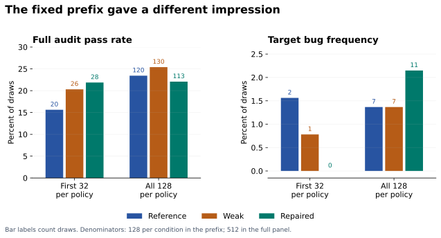

# Repairing a code verifier without establishing a training benefit

I replaced eight tests in a deliberately weakened code verifier. Across 2,048 evaluated program draws, the repaired verifier rejected all 38 observed false acceptances and retained all 440 audit-passing draws.

That was a clear improvement in grading those programs. The training result was inconclusive. After training Qwen2.5-Coder-1.5B-Instruct under three verifier conditions across four paired seeds, the weak and reference conditions each produced seven instances of the target bug in 512 final draws. The repaired condition produced eleven.

The experiment asked whether correcting a reward mechanism improves learned behavior. Answering it required measuring the verifier and the trained policies separately, completing an evaluation that changed the initial impression, and recovering from infrastructure failures without changing what counted as an observation.

[Technical report](booking_replication_analysis.md) · [Scores and figures](../reports/booking-blog/) · [Methods and additional checks](booking_publication_review.md)

## The verifier rewarded the wrong endpoint rule

The task was to implement `required_capacity(bookings)`, the maximum number of simultaneously active bookings. Intervals were explicitly half-open: a booking ending at time 3 releases capacity before another starts at time 3.

```python
required_capacity([[1, 3], [3, 5]])  # expected: 1
```

An implementation that counts both bookings as active at time 3 returns 2. A test suite without shared endpoints can miss that mistake.

I used that property to construct a controlled weakness. The reference verifier scored 96 training cases. Removing 39 shared-endpoint cases left a weak verifier with 57. The fixed repair exchanged eight ordinary cases in that weak suite for eight endpoint cases from the training suite.

| Verifier | Cases scored for reward | Treatment of the endpoint bug |
|---|---:|---|
| Reference | 96 | Distinguishes it from the correct rule |
| Weak | 57 | Awards it full reward |
| Repaired | 57 | Distinguishes it from the correct rule |

The repair was chosen using authored cases and an inclusive-endpoint oracle before the replication results. It matched the weak verifier's **number of scored tests**. For each extracted training program, every condition executed the same 96 inputs; the controller selected which outcomes contributed to reward. This experiment therefore demonstrates no execution-cost saving from the repair. It also did not match test difficulty, information content, or every property of the reward distribution. [Frozen protocol](booking_replication_repair_protocol.txt), [verifier implementation](../verifier_rl/booking_replication.py).

The weakness was deliberately constructed. Observing incorrect code earn full reward demonstrates a specification mismatch; it does not establish that the model intentionally exploited it.

## The pilot motivated a fixed replication

An earlier one-seed pilot produced three target-bug programs out of 32 final weak-policy draws, compared with one out of 32 for reference. That was enough to motivate a follow-up, with the pilot retained separately.

For the replication, I fixed four new training seeds, three conditions, and a final endpoint of 24 GRPO updates per run. Every run started from the same original model weights with a fresh optimizer. Within a seed, the conditions shared their first rollout tokens; later samples could diverge as the policies changed.

GRPO compares the rewards of completions generated for the same prompt. Here each update used four completions, with reward equal to the fraction of selected tests passed and normalization within the group. The learning rate was `1e-6`, the KL coefficient was zero, and responses were capped at 512 tokens. The 12 runs comprised 288 updates and 1,152 training completions. [Recorded configuration](booking_replication_repair_protocol.txt), [GRPO formulation](https://huggingface.co/docs/trl/v0.28.0/grpo_trainer).

Evaluation used one shared 128-draw baseline, 32 draws at update 12 for each policy, and 128 at update 24: 2,048 draws in total. The final comparisons used all planned draws, with shared sampling seeds across policies. The pilot was not added as a fifth seed, and the intermediate checkpoint was not used to select the best result.

The audit comprised 192 development cases and had already been used in the pilot. **The audit suite was not used to compute training rewards; the training and audit suites share the mandatory empty-input case.** Passing the audit means success on this finite suite. It does not prove correctness on every valid input. The [publication notes](booking_publication_review.md) clarify the historical protocol's broader wording without altering its frozen record.

## The repair caught all observed false acceptances

Applying all three verifiers to the same 2,048 draws separated grader behavior from training effects.

| Verifier | Accepts audit-passing draws | Accepts audit-failing draws |
|---|---:|---:|
| Reference | 440 | 0 |
| Weak | 440 | 38 |
| Repaired | 440 | 0 |

The 38 false acceptances represented 33 distinct source hashes. I inspected every one and revalidated its saved execution records: 287 unique inputs per program, or 10,906 protected input outcomes. This checked the existing evidence without executing the generated code again.

Thirty-four draws matched the inclusive-endpoint oracle on all 287 inputs. One heap-based implementation removed an old booking only when its end was strictly less than the next start. Its saved witness was:

```python
[[3664, 3670], [3670, 3676]]  # expected: 1; observed: 2
```

The other four draws exposed a limitation of the target-bug detector. Their event lists were sorted by time alone, allowing the input order to determine which event came first at a shared endpoint. They failed the specification without matching the exact inclusive signature.

All recorded failures among these 38 draws involved shared endpoints. The narrow signature missed four of the verifier's acceptance errors; the broader audit caught them. That made the two measurements useful together. The full [failure catalog](../reports/booking-replication/analysis.json) preserves source, scores, and concrete witnesses.

These are observed cohort results. They establish neither a universally error-free verifier nor an optimal eight-test repair.

## The final training comparison stayed inconclusive

Each condition contributed 512 final draws: 128 from each of four trained policies.

| Final metric | Reference training | Weak training | Repaired training |
|---|---:|---:|---:|
| Full audit pass | 120/512 — 23.44% | 130/512 — 25.39% | 113/512 — 22.07% |
| Target endpoint signature | 7/512 — 1.37% | 7/512 — 1.37% | 11/512 — 2.15% |
| Mean audit case accuracy | 40.03% | 39.52% | 42.68% |

The weak-minus-reference difference in target-bug counts was 0, −3, +3, and 0 across the four seeds. The average was zero because the nonzero differences cancelled. The pilot's positive amplification pattern did not reproduce as a positive average effect.

The repaired-minus-weak differences were 0, +1, +1, and +2 target-bug draws. No seed pair showed an observed reduction in that signature. Full audit success favored repaired training in two pairs and weak training in two.


The mean repaired-minus-weak full-pass difference was −3.32 percentage points, with an exploratory 95% paired t interval from −12.48 to +5.84. For target-bug frequency, the difference was +0.78 points, with an interval from −0.23 to +1.80. Both improvement and deterioration remain compatible with these approximate intervals.

The replication unit is the **training seed**. Hundreds of draws estimate the behavior of a trained policy; hundreds of tests measure each program. Neither creates more independently trained policies. With four seeds, the t approximation is fragile, particularly for a rare behavior. The interval method was selected during analysis, and these are not confirmatory significance or equivalence claims. [Every seed pair and interval assumption](booking_publication_review.md), [paired-observation method](https://www.itl.nist.gov/div898/handbook/prc/section3/prc311.htm).

The defensible conclusion is that this experiment did not establish amplification by weak rewards or a training benefit from the repair. It also did not establish that the repair harms learning.

## Completing the evaluation changed the apparent result

The first 32 draws per final policy would have told a more favorable story about repaired training. Across those four prefixes, repaired policies produced 28 fully passing programs out of 128 and no target signatures. Weak policies produced 26 fully passing programs and one target signature.

The complete panels reversed the full-pass ordering and revealed eleven repaired-policy target signatures.



This compares one predetermined prefix with its complete panel. It is a descriptive sampling check, not a resampling study or a learning trajectory. It illustrates why finishing the planned evaluation mattered: stopping early would have hidden every observed final repaired-policy target signature.

## A better acceptance decision can still leave a difficult reward signal

The repaired condition had higher mean audit case accuracy than weak training, 42.68% versus 39.52%, despite producing fewer fully passing programs. The score distribution makes that disagreement easier to see.


Compared with weak training, repaired training produced 63 fewer draws passing at most one audit case, 80 more partial solutions, and 17 fewer fully passing programs. These are differences between sampled populations; they do not show individual failures being converted into partial solutions. The categories were selected after inspecting the distribution.

There is also a distinction between rejecting a program at the full-score threshold and discouraging it during training. The inclusive bug scored 49/57 under the repair, about 86%. In a hypothetical group containing a correct solution, that buggy solution, a constant-zero program, and an extraction failure, the buggy solution remains above the group's average reward. Its normalized advantage is still positive.

Place the same buggy solution alongside three correct programs and its repaired advantage becomes negative. **Those are illustrative groups, not reconstructed training rollouts.** They show why an acceptance correction alone cannot determine the learning signal. The local export does not include every original training completion and its group rewards, so it cannot establish how often either situation occurred. [Reproducible illustration](booking_publication_review.md).

A separate exploratory comparison also found that repaired partial scores disagreed with audit-based program ordering slightly more often than weak scores did: 1.89% versus 1.61% on the same eligible pairs. Those pairs share programs and are not independent experiments. This observation motivates examining partial rewards, but does not explain the training outcome. [Ordering analysis](booking_behavior_findings.md).

## Infrastructure failures had to remain separate from model failures

An interrupted evaluation creates a scientific problem when the system changes its meaning during recovery. A missing result is ambiguous. Treating it as a wrong answer changes the reward; silently replacing it with another execution changes the observation process.

One real incident began when an evidence-store callback failed inside the candidate-transport error path. The system stopped after recording 25 input outcomes, leaving 71 inputs unsubmitted. Unknown outcomes blocked the training update.

I changed the persistence path to commit immutable execution evidence before publishing its index. Storage publication had bounded retries. An execution with an ambiguous outcome remained ineligible for automatic replay.

The recovery control deliberately exhausted all three final-index publication attempts. It then reloaded the saved evidence and recovered with an executor that would raise if called. The two authored control inputs had executed once each; recovery caused zero reexecutions. For the research program, recovery retained the 25 original outcomes and executed only the 71 inputs proven not to have been submitted. [Incident and fault-injection record](program_storage_recovery.txt).

Training recovery required more than restoring weights. A separate interruption control checked optimizer, scheduler, RNG, pending rollout, and subsequent fresh rollout against uninterrupted training. Those checks protected the meaning of a continued run. They were infrastructure controls, not additional coding-performance observations. [Full-state recovery record](booking_matched_training_release.txt).

Throughput mattered too. The original design created one sandbox per input and ran into a sandbox-start rate limit. The replacement used one fresh sandbox per program and a fresh restricted Python child for each input. On a fixed seven-program, 2,009-input benchmark, sequential grading took 391.51 seconds and four-program parallel grading took 142.49 seconds, with identical grades: **2.75× measured grading throughput**. That measures concurrency on this workload, not an end-to-end study speedup. A fresh child process also is not a fresh virtual machine. [Benchmark and isolation controls](program_sandbox_benchmark.txt).

## What I would test next

The main limits are one deliberately constructed task, one small model, four training seeds, a short intervention, a rare target behavior, and an existing development audit. More test executions cannot resolve all of them.

A follow-up should specify a smallest effect worth detecting and set its training and evaluation budgets before seeing outcomes. I would preserve every training group's completions, per-verifier scores, and advantages to measure whether the repaired rule actually changes incentives for the target behavior. A fresh audit and additional tasks would test transfer. A randomized test-replacement condition could help separate the value of the chosen endpoint cases from a general change in test composition.

Those are proposed experiments. The completed study establishes a narrower result: the repair corrected the observed acceptance errors, and the evidence did not establish a corresponding training benefit. Preserving that distinction is the most useful outcome of the experiment.

## Inspecting and reproducing the result

The [portable score table](../reports/booking-blog/program_scores.csv) and [offline analysis script](../scripts/booking_publication.py) reproduce the article's counts, paired intervals, distributions, and sampling comparison with Python's standard library. The [methods note](booking_publication_review.md) distinguishes that arithmetic reproduction from validation against the saved execution evidence and a fresh training run. The [complete study record](booking_complete_study_record.md) retains the larger evidence archive, including its exclusions.
