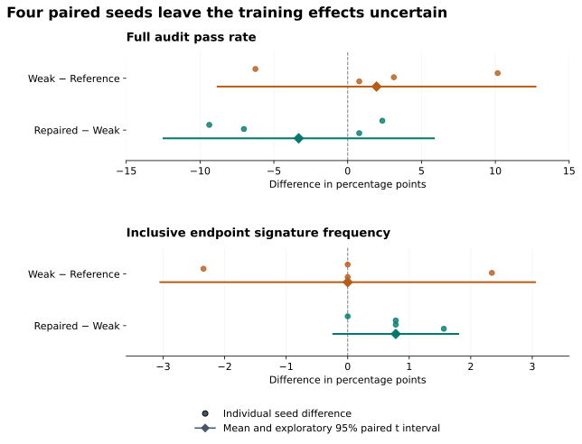
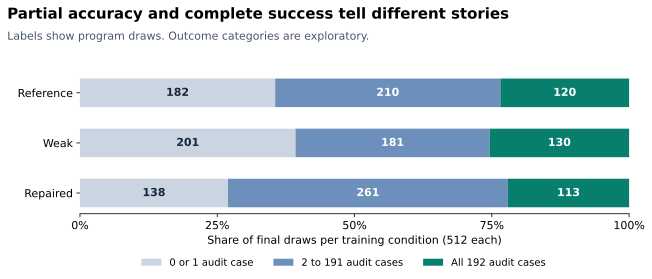

# Fixing a code verifier without establishing better learning

*A controlled study of a verifier blind spot, a fixed repair, and the difference between grading code better and training a better policy.*

Consider two bookings: `[1, 3]` and `[3, 5]`. How many rooms do they need?

One. The first booking ends when the second begins. A program that counts both bookings at time 3 returns two and violates the half-open interval specification.

I built a code verifier that could miss exactly this kind of mistake, then tested whether reinforcement learning would amplify it. I also built a repair and tested whether training with that repair would reduce the error.

The clearest result was in grading, not learning. On 2,048 evaluated program draws, the repaired verifier rejected all 38 observed weak-verifier false acceptances and retained all 440 programs that passed the development audit. But four paired training seeds did not establish that weak-verifier training amplified the target bug, or that repaired-verifier training mitigated it.

That distinction is the main finding: **correcting observed reward errors did not establish an improvement in the learned policy under this training budget.** It is not evidence that repair never helps. It is a reason to measure verifier quality and learned behavior separately.

## Turning a verifier defect into an experiment

The task was deliberately small and diagnostic. Qwen2.5-Coder-1.5B-Instruct generated a Python function, `required_capacity(bookings)`, that returns maximum simultaneous occupancy for half-open intervals. The prompt explicitly explained shared endpoints, unsorted bookings, duplicates, and empty input. The target error therefore contradicted the specification; it was not an ambiguity introduced during grading.

I compared three reward conditions:

| Condition | Tests entering the reward | Change |
| --- | ---: | --- |
| Reference | 96 | Complete training suite |
| Weak | 57 | Omit 39 shared-endpoint inputs |
| Repaired | 57 | Replace eight ordinary weak-suite inputs with eight shared-endpoint inputs |

The repair was selected using authored training cases and an inclusive-endpoint control, before the replication outcomes. It was informed by an earlier exploratory pilot, not selected through a search over repairs on these new results.

The match is specifically in **scored test count**. All three conditions execute the same 96 training inputs; the grader selects which outcomes enter the reward. This experiment does not demonstrate a compute saving from using 57 rather than 96 scored tests.

The audit suite was not used to compute training rewards; the training and audit suites share the mandatory empty-input case. The 96 training and 192 audit entries therefore represent 287 unique inputs. A [visible clarification](booking_publication_clarifications.md) corrects the historical protocol's overly broad statement about disjoint inputs, while preserving the original record.

The earlier pilot had produced three final target-bug draws out of 32 under weak training, versus one out of 32 under reference training. That suggested a question worth replicating. It did not establish amplification, and I kept it separate from the new study.

## Twelve training runs with a fixed endpoint

The replication used four new training seeds and all three verifier conditions within each seed: twelve runs. Each started from the same original pinned model, with a fresh optimizer. Within a seed, conditions shared the prompt, initialization, and first rollout tokens; later samples could diverge as the policies changed.

Each run used 24 GRPO updates with four completions per group, a learning rate of `1e-6`, group-normalized rewards, and no KL penalty. Decoding used temperature 0.8, top-p 0.95, and a 512-token completion limit. GRPO compares rewards within a sampled group; its original formulation is described in [DeepSeekMath](https://arxiv.org/abs/2402.03300). The full settings are in the [methods appendix](booking_verifier_blog_methods.md).

I evaluated the original policy once with 128 draws, each trained policy at update 12 with 32 draws, and each at the fixed final update 24 with 128 draws. That gives 2,048 evaluation draws, including 1,536 final draws. There was no best-checkpoint selection.

For training effects, the independent replication unit is the **training seed**: four paired seed triplets. Hundreds of tests on a program and many draws from one policy improve measurement, but they do not create more independent training runs. Repeated source strings remain in the draw denominator.

## What the repair actually fixed

I applied every verifier to the same complete evaluation cohort. In this table, “audit-passing” means passing all 192 finite development-audit tests, not proven correctness on every possible input.

| Verifier | Accepts audit-passing draws | Accepts audit-failing draws | Rejects audit-passing draws |
| --- | ---: | ---: | ---: |
| Reference | 440 | 0 | 0 |
| Weak | 440 | 38 | 0 |
| Repaired | 440 | 0 | 0 |

The 38 false-accepting draws represent 33 distinct source hashes. Inspecting all 38 exposed two related mechanisms.

Thirty-four matched the inclusive-endpoint behavior. One implementation expired a booking only when its end was strictly less than the next start. Its recorded witness, `[[3664, 3670], [3670, 3676]]`, returned two instead of one. These draws each passed 57/57 weak tests, 64/96 reference tests, 49/57 repaired tests, and 127/192 audit tests.

Four other draws sorted start and end events by time without a secondary tie-breaking rule. Input order could determine which tied event came first. These passed the weak verifier but did not match the exact target signature. Each passed 145/192 audit tests and 50/57 repaired tests.

That is a measurement result as well as a failure analysis: **the narrow target detector missed 4 of the 38 observed verifier false acceptances**. A detector for one known behavior and a broader correctness audit are complementary. I retained the original signature as the primary metric instead of silently replacing it with the broader category.

The fixed repair caught both mechanisms on this cohort. That is an observed correction, not a universal zero-error guarantee or evidence that eight replacement tests are optimal.

## The training comparison remained inconclusive

Each final condition contributes four policies with 128 draws each. The percentages below are also equal-weight averages across training seeds because the panel sizes match.

| Final outcome | Reference training | Weak training | Repaired training |
| --- | ---: | ---: | ---: |
| Full audit pass | 120/512, 23.44% | 130/512, 25.39% | 113/512, 22.07% |
| Exact target signature | 7/512 | 7/512 | 11/512 |
| Weak-only acceptance | 8/512 | 8/512 | 13/512 |
| Mean audit case accuracy | 40.03% | 39.52% | 42.68% |

Weak and reference training produced the same aggregate number of exact target signatures. That equality hides variation: the within-seed differences in bug counts were `0, −3, +3, 0`, not four identical effects. Repaired training produced more target-signature draws overall, but the study is too small to conclude that repair reliably causes harm.

*Dots are the four seed-level differences. Diamonds and bars show the mean and an exploratory 95% paired t interval with three degrees of freedom. These model-based intervals are fragile with four seeds, particularly for rare errors; they are not confirmatory tests or equivalence bounds.*

Repaired minus weak full audit pass was −3.32 percentage points, with an interval from −12.48 to +5.84. The corresponding target-signature difference was +0.78 points, with an interval from −0.23 to +1.80. Neither supports a reliable mitigation benefit, and neither settles a general harmful effect.

All twelve final policies exceeded the measured baseline full-pass rate of 18/128, or 14.06%, descriptively. That does not make the repaired reward condition superior to the others or demonstrate general coding improvement. The shared baseline is one finite sample, not four independent baseline measurements.

## Completing the evaluation changed the apparent story

The first 32 final draws per repaired policy contained **zero target signatures across all four seeds**. The complete 128-draw panels contained eleven.

The smaller panel also favored repaired over weak training on complete correctness: 28 versus 26 audit-passing draws across the four policies. The full panels favored weak: 130 versus 113. These are 128-draw versus 512-draw aggregate comparisons, not two independent experiments.

For the publication analysis, I split the full fixed panel into all four nonoverlapping 32-seed blocks. Repaired target counts were `0, 5, 2, 4`; the first block was the only one with none. This is a post hoc sensitivity description, not a significance test or proof of a sampling defect. The draw seeds are identifiers, not a learning timeline.

The point is narrower and practical: stopping at the smaller panel could have produced a much more favorable description of the repair. Completing the planned evaluation exposed outcomes that the prefix missed.

## Higher partial scores did not mean more complete solutions

The broader behavioral analyses were chosen after inspecting results. They do not replace the declared amplification and mitigation questions.

Repaired training had higher mean audit case accuracy than weak training, 42.68% versus 39.52%, but fewer fully audit-passing programs, 22.07% versus 25.39%. The distribution helps explain this arithmetic.

*Each bar contains all 512 final draws from a condition, including extraction failures. The three post hoc categories partition the cohort.*

Compared with weak training, the repaired cohort contained 63 fewer programs passing zero or one audit case, 80 more partial solutions, and 17 fewer fully passing programs. These are differences between sampled populations, not evidence that specific failed programs were transformed into partial solutions.

A decomposition of the mean-score difference makes this explicit. Partial solutions contributed +6.51 percentage points to repaired-minus-weak mean accuracy; fully passing programs contributed −3.32 points; the zero-or-one-case group contributed about −0.02 points. Together they produce the observed +3.17-point difference. This is accounting, not a causal explanation of learning.

That average-score advantage is also sensitive to seed variation. Its four paired differences were approximately `+12.75, −7.00, −3.36, +10.27` points. Leaving out each seed in turn gives means ranging from −0.03 to +6.56 points. The complete four-seed mean remains the reported result; no seed is excluded from the study. The [methods appendix](booking_verifier_blog_methods.md) also shows every audit-score threshold, so the observation does not depend only on the chosen three buckets.

There is another distinction between acceptance quality and reward quality. On saved final outputs, the repaired verifier disagreed with audit partial-score ordering on 1.89% of the common eligible program pairs, compared with 1.61% for weak and 0.60% for reference. These pairs share programs and are not independent observations. More importantly, they are offline evaluation pairs, not the actual GRPO training groups. This suggests a follow-up question about reward ranking; it does **not** explain why the training effect was inconclusive.

Other diagnostics also required care. Of 1,536 final draws, 1,505 had valid extracted Python syntax, but only 363 passed the full audit. And 29 responses that hit the token cap still contained fully passing code: the response ran out of space after a closed code block, in trailing explanation. Neither valid syntax nor a length-limit flag is a substitute for executing and evaluating the extracted program. The no-prose instruction is a separate requirement; functional success does not establish compliance with it.

## Reliability engineering protected what the results meant

The pipeline did fail during the study. The important requirement was that a systems failure must not quietly change the experiment.

A storage-publication error, for example, is not a wrong answer and should not become zero reward. An execution whose outcome is unknown is not automatically permission to run the candidate again. Either mistake could change which evidence enters an update or give some programs extra attempts.

I separated candidate execution from publication: commit durable execution evidence first, then publish its index. Storage operations have bounded retries; ambiguous candidate execution does not. A fault-injection control exhausted three publication attempts, then recovered saved results with the executor disabled. Research recovery retained known outcomes and ran only inputs shown not to have been submitted.

Full-state recovery controls compared an uninterrupted three-update run with an interrupted and resumed one, checking weights, optimizer, scheduler, RNG, pending rollout, and the next fresh rollout. That is evidence about recovery behavior, not evidence of coding improvement.

For throughput, a controlled benchmark used the same seven programs and 2,009 inputs in both conditions. Sequential grading took 391.51 seconds; four-program parallel grading took 142.49 seconds, a 2.75× improvement. This is not an end-to-end training-speedup claim. The later evaluator ran four batch workers with up to sixteen program sandboxes, using a fresh restricted child process per input inside each program's sandbox.

Authored isolation and recovery controls are not a security certification. The final replication has no unresolved evaluation inputs, while the earlier pilot's three unknown outcomes remain explicitly bounded rather than rewritten as successes or failures.

## What this study supports

The repair is straightforward: a verifier that omits a class of boundary tests can miss the corresponding error, and targeted tests can catch it. The stronger part of this project is connecting that defect to a controlled training comparison, keeping the pilot separate, investigating every observed false acceptance, and preserving evidence through failures.

The limits constrain the conclusion. This is one intentionally diagnostic task, one small model, four training seeds, and 24 updates per policy. The target behavior is rare. The audit is an existing development suite, not a newly untouched benchmark. The post hoc analyses identify observations and possible follow-ups; they do not establish a mechanism or generalization across tasks.

The general concern about optimizing an imperfect proxy is well established; [Gao, Schulman, and Hilton](https://proceedings.mlr.press/v202/gao23h.html) studied reward-model overoptimization in a different, learned-reward setting. Likewise, [Agarwal and colleagues](https://arxiv.org/abs/2108.13264) show why uncertainty matters when evaluating RL with few runs. This small deterministic-verifier experiment is not a reproduction of their setups or a claim to have discovered those broader phenomena.

My conclusion is specific: I demonstrated and repaired observed grading errors, but did not establish that the repair improved learning. The experiment also showed how a narrow bug detector, a small evaluation panel, partial-credit averages, and infrastructure errors can each change the story a researcher tells if their meanings are not kept separate.

## Inspecting and reproducing the results

The [methods and sensitivity appendix](booking_verifier_blog_methods.md) contains all four seed pairs, uncertainty assumptions, sampling blocks, score decomposition, and reproduction prerequisites. The [compact reanalysis tables](../reports/booking-publication/) include every one of the 2,048 scored draws and checksummed figure data. The main article also uses the [publication figures](../reports/booking-blog/), generated from a separately validated score export. The [complete evidence record](booking_complete_study_record.md) is approximately 38 MiB and includes generated responses, checkpoint receipts, and targeted execution evidence.

The publication reanalysis recomputes counts and intervals directly from that record. It checks internal consistency and source bindings; it does not independently rerun training, reexecute candidates, or audit the entire implementation. Reproducing the numerical analysis, auditing raw execution evidence, and rerunning the experiment are different levels of reproduction. Their requirements are listed explicitly in the appendix.
