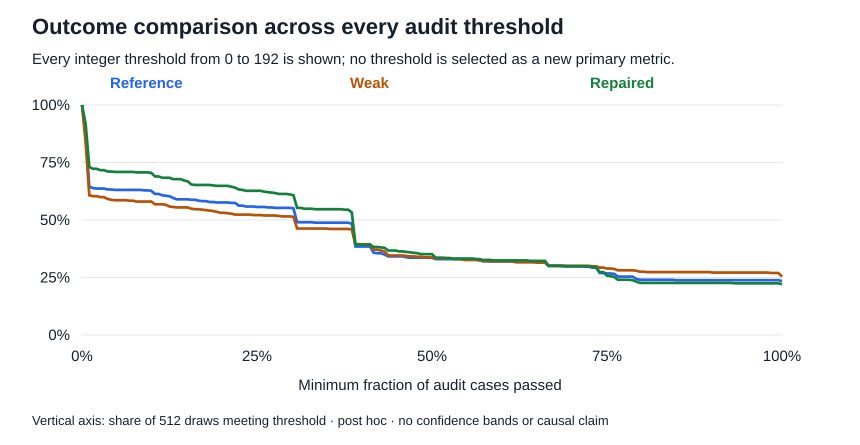

# Methods and sensitivity checks for the booking verifier article

This appendix supports [Fixing a code verifier without establishing better learning](booking_verifier_blog.md). It distinguishes the frozen comparisons from later exploratory analyses, states what was verified locally, and provides a short route to the data behind the claims. Nothing in this appendix authorizes another experiment or changes the original endpoint.

## Evidence checked for this draft

The publication analyzer reads the entire [complete study record](booking_complete_study_record.md), verifies its SHA256 against the existing manifest, parses every embedded JSON block, and recomputes the headline results from all 2,048 individual evaluation rows. Each row's sample identity and extracted-source hash are checked. Pass counts, reward fractions, full-pass flags, fixed draw panels, and zero unknown inputs must agree. All 25 cohorts must be present; missing or duplicated samples are errors.

It also reads the 288 checkpoint receipts, twelve complete training logs, and all 288 logical case definitions embedded in the archive. The existing archive-validation tests check those receipts, log fields, original generated responses, and all 38 targeted protected program documents against their local source files. They also verify source fingerprints and document navigation.

This is an internal consistency and provenance check of saved evidence. It is not an independent training replication, fresh execution of every candidate, model-tensor rehash, or comprehensive implementation audit. The fact that a number appears in a checksummed file does not prove the implementation that produced it was correct. Historical controls and the targeted raw-evidence checks supply additional, separately scoped evidence.

The reanalysis imports only Python's standard library and does not execute generated code, load a model, or contact Modal. Its input archive hash is `deff92ce68edfb264247c315c092cc7ca32168bec1c9d0669a638fe6968f06c4`. The [output manifest](../reports/booking-publication/manifest.json) binds the analyzer and generated tables and figures to that input.

Local validation passed 77 checks: 17 publication-analysis tests, 13 complete-archive tests, and 47 existing replication, protocol, failure-analysis, and behavioral-analysis tests. The three new SVG figures and the two reused article figures were rendered and visually inspected; local document links and generated-output hashes were checked. Rendering in a future website remains a separate release check.

## Which decisions were fixed in advance

| Item | Status |
| --- | --- |
| Four new seeds, three conditions, 24 updates, fixed evaluation panels | Frozen before replication outcomes |
| Eight specific replacement training tests | Fixed using authored controls and the earlier pilot, before replication outcomes |
| Weak minus reference and repaired minus weak comparisons | Declared comparisons |
| Final audit full-pass rate and exact inclusive-endpoint signature | Declared primary metrics at update 24 |
| Update 12 and other metrics | Trajectory or secondary evidence, not checkpoint selection |
| Paired t interval implementation | Chosen during analysis; exploratory uncertainty |
| Inclusive and order-sensitive failure taxonomy | Post hoc source and recorded-outcome investigation |
| Partial-score ordering, outcome buckets, token-cap examples | Post hoc behavior analyses |
| Leave-one-seed-out means, all-threshold curve, score decomposition, four draw blocks | Post hoc publication sensitivity checks |

The original pilot is not added as a fifth replication seed. Its three unresolved input outcomes remain bounded, including a reference final full-pass count of 3–4 out of 32. Missing-data bounds are not confidence intervals.

## Model training and evaluation design

The model was `Qwen/Qwen2.5-Coder-1.5B-Instruct`, pinned at revision `2e1fd397ee46e1388853d2af2c993145b0f1098a`. All twelve runs loaded the original model with fresh AdamW state, not a pilot checkpoint or project SFT model. The four seeds were 20261011–20261014.

The common settings were 24 updates, four completions per group, per-device batch size one, gradient accumulation four, one iteration per rollout, group reward scaling, token-level importance sampling, GRPO clipping epsilon 0.2, beta zero, constant learning rate `1e-6`, zero weight decay, gradient checkpointing, and maximum gradient norm one. Training used FP32 weights with BF16 autocast. Sampling used temperature 0.8, top-p 0.95, top-k zero, repetition penalty 1.05, and at most 512 completion tokens. Truncated completions were not automatically masked out of training.

The three conditions shared the seed, initial weights, prompt, and first sampled token groups within each seed. Subsequent draws could diverge. Condition order was predeclared and rotated, but four seeds and three arms do not form a perfectly balanced Latin square. Runtime and recovery amendments are documented separately; they did not change GRPO or the reward definition.

The reward was the fraction of selected training tests passed: 96 for reference, 57 for weak, and 57 for repaired. The repair removed `training/ordinary/08` through `/15` and added `training/boundary/08` through `/15`, under the `booking-coverage-reward-0.2/` case prefix. Every arm still executed the same 96 training inputs.

The development audit was not used to compute training rewards. It shares the mandatory empty input with the training suite; it is also the audit previously used in the pilot, not a new untouched benchmark. The [publication clarification](booking_publication_clarifications.md) preserves and corrects the original protocol wording explicitly.

There was one 128-draw baseline, twelve 32-draw intermediate cohorts, and twelve 128-draw final cohorts: 2,048 draws. Final sampling seeds were 19000–19127; intermediate evaluation used the first 32. Source-extraction failures and repeated sources remain in the denominator. Primary comparison uses the fixed final checkpoint, not the highest audit result.

## The complete seed table

Each entry is a count out of 128 final draws from that policy. R, W, and P denote reference, weak, and repaired **training** conditions, not different graders applied to one policy.

| Training seed | R audit full | W audit full | P audit full | R exact bug | W exact bug | P exact bug |
| --- | ---: | ---: | ---: | ---: | ---: | ---: |
| 20261011 | 29 | 21 | 24 | 2 | 2 | 2 |
| 20261012 | 32 | 45 | 33 | 3 | 0 | 1 |
| 20261013 | 27 | 31 | 22 | 1 | 4 | 5 |
| 20261014 | 32 | 33 | 34 | 1 | 1 | 3 |
| All draws | 120 | 130 | 113 | 7 | 7 | 11 |

## Uncertainty and seed influence

For each metric, the estimator first computes the condition difference within each training seed, then averages the four differences. Since every final policy has 128 draws, this equals the difference of the descriptive pooled rates. That algebra does not make the 512 draws independent training replications.

The displayed interval is `mean(d) ± 3.1824463053 × sample_sd(d) / sqrt(4)`, using a Student t critical value with three degrees of freedom. It is model-based, conditional on the task and fixed evaluation panel, and assumes independent, approximately normal training-seed differences. With four seeds, particularly for rare signatures, those assumptions cannot be well assessed. It is not a hierarchical bootstrap, a simultaneous interval, a test of equivalence, or a guarantee of nominal coverage for these sparse outcomes. See the [NIST paired-observation method](https://www.itl.nist.gov/div898/handbook/prc/section3/prc311.htm) and [t critical values](https://www.itl.nist.gov/div898/handbook/eda/section3/eda3672.htm).

| Contrast | Metric | Mean difference pp | Exploratory 95% interval pp | Range of leave-one-seed-out means pp |
| --- | --- | ---: | --- | --- |
| Weak minus reference | Full audit pass | +1.95 | −8.81 to +12.72 | −0.78 to +4.69 |
| Weak minus reference | Exact target signature | 0.00 | −3.05 to +3.05 | −0.78 to +0.78 |
| Repaired minus weak | Full audit pass | −3.32 | −12.48 to +5.84 | −5.21 to −1.30 |
| Repaired minus weak | Exact target signature | +0.78 | −0.23 to +1.80 | +0.52 to +1.04 |
| Repaired minus weak | Mean audit case accuracy | +3.17 | −12.43 to +18.76 | −0.03 to +6.56 |

Leave-one-seed-out means are an influence diagnostic, not additional estimates to choose among or uncertainty intervals. The primary mean always retains all four seeds. For example, omitting seed 20261011 changes repaired-minus-weak average case accuracy to −0.0285 points; omitting seed 20261012 changes it to +6.5552 points. Two seed pairs favor repaired mean accuracy and two favor weak. This weakens a general “better partial learning” interpretation even though the aggregate arithmetic remains correct.

All eight examined combinations of contrast and metric—including token-cap rate and weak-minus-reference partial accuracy—are retained in [analysis.json](../reports/booking-publication/analysis.json). Every omission result is in [seed_sensitivity.csv](../reports/booking-publication/seed_sensitivity.csv). No favorable subset replaces the complete result.

## A decomposition of average case accuracy

For a cohort of `N` programs, mean audit accuracy is `sum(passed_i) / (192 × N)`. Partitioning draws into disjoint buckets partitions the numerator exactly. Bucket contributions below use the **whole cohort denominator**, not the conditional mean score within a bucket.

| Outcome bucket | Weak draws | Repaired draws | Weak contribution to mean pp | Repaired contribution pp | Difference pp |
| --- | ---: | ---: | ---: | ---: | ---: |
| Zero or one audit pass | 201 | 138 | 0.1190 | 0.0977 | −0.0214 |
| Two through 191 passes | 181 | 261 | 14.0076 | 20.5149 | +6.5074 |
| All 192 passes | 130 | 113 | 25.3906 | 22.0703 | −3.3203 |
| Total | 512 | 512 | 39.5172 | 42.6829 | +3.1657 |

The +3.17-point mean difference is therefore compatible with fewer fully passing programs: the partial bucket contributes more, offsetting the smaller fully passing bucket. Both bucket frequencies and scores within a bucket can contribute to that difference. This is a decomposition of observed populations, not a model of how an intervention moves individual programs between categories.

## Checking every score threshold

The zero-or-one category was selected after seeing the results. To make that choice inspectable, the publication analysis also reports the fraction of draws passing at least `k` audit cases for **every integer k from zero to 192**.



*These are descriptive empirical survival curves with 512 draws per condition. They are not 193 independent hypothesis tests, and no threshold is promoted to a new primary endpoint.*

For example, repaired minus weak is +12.30 points at a threshold of two cases, +10.55 points at 48, +1.56 points at 96, −3.13 points at 144, and −3.32 points at all 192. This shows why a lower-score success criterion and full-program success can favor different conditions. It does not estimate performance on unseen tests or tasks. [All threshold counts](../reports/booking-publication/audit_thresholds.csv) are available, including ties and unfavorable thresholds.

## All four disjoint draw blocks

Each block uses 32 fixed draw seeds for each of the four trained policies in a condition, hence 128 draws per cell. Blocks are separate portions of the same final evaluation panel, not training checkpoints or independent model replications.

| Draw seed block | R audit full | W audit full | P audit full | R exact bug | W exact bug | P exact bug |
| --- | ---: | ---: | ---: | ---: | ---: | ---: |
| 19000–19031 | 20 | 26 | 28 | 2 | 1 | 0 |
| 19032–19063 | 30 | 38 | 32 | 1 | 1 | 5 |
| 19064–19095 | 32 | 31 | 28 | 3 | 3 | 2 |
| 19096–19127 | 38 | 35 | 25 | 1 | 2 | 4 |
| Complete panel | 120 | 130 | 113 | 7 | 7 | 11 |

The initial prefix is fixed, not a prefix chosen to maximize an effect. Showing the other three blocks is nevertheless a post hoc inspection. No probability of “missing eleven errors,” p-value, sample-size recommendation, or conclusion about random-seed quality is inferred from this table. [Exact block metrics](../reports/booking-publication/sampling_blocks.csv) include partial accuracy and cap rates as well.

## Acceptance error and partial reward ordering are separate analyses

The mixed-cohort confusion matrix applies all three verifiers to the same 2,048 draws. The weak verifier has 38 false acceptances among 478 accepted draws, or 7.95%; it falsely accepts 38 of the 1,608 audit-failing draws, or 2.36%. These are different denominators. The repair rejects all 38 and accepts all 440 audit-passing draws on this cohort. Audit agreement is not universal correctness.

The 38 draws contain 33 distinct source hashes. The narrow 96-training-input signature identifies 34; the other four have recorded order-sensitive endpoint failures. The original protected evidence was investigated for every false-acceptance draw, not only selected examples. Matching a finite oracle signature is not evidence of intent or a proof of program semantics for all inputs.

The separate partial-score analysis compares the order of saved final program draws under each verifier with their order by audit case accuracy. It uses the same 996,421 unordered pairs untied on the audit and all three verifiers. Discordant counts are reference 5,969, weak 16,050, and repaired 18,829. Rates are 0.60%, 1.61%, and 1.89%. Pairs share programs; the denominator is not a sample size for independent inference. Verifier-specific tie exclusions are also reported in the [earlier exploratory analysis](booking_behavior_findings.md).

These saved evaluation pairs are not the groups of four used for GRPO updates. The local compact export does not contain every raw training rollout and per-completion reward journal. Consequently, the ordering result cannot establish which actual advantages caused the training trajectory. Changing case composition or reward ordering is a hypothesis for follow-up, not a demonstrated explanation of the inconclusive training result.

## Engineering results and their boundaries

The [storage failure control](program_storage_recovery.txt) tested durable evidence before index publication and recovery after exhausting bounded publication retries, with candidate execution disabled during replay. The research continuation reused known outcomes and executed only inputs proven unsubmitted. It did not convert infrastructure failures into wrong-answer rewards or silently rerun ambiguous attempts.

The [full-state control](booking_matched_training_release.txt) compared interruption and restart with an uninterrupted three-update reference, including optimizer, scheduler, RNG, parameter hashes, pending samples, and the next fresh group. This control does not establish perfect reproducibility across arbitrary software or hardware changes.

The [execution benchmark](program_sandbox_benchmark.txt) used the same seven programs and 2,009 inputs in each mode. `391.51018041 / 142.489303857 = 2.74765`, rounded to 2.75×. Thirteen live controls passed and 84 old/new execution pairs matched. Do not substitute the later canary's unequal serial/parallel workload times for this benchmark, or describe the ratio as whole-study acceleration. Restricted pure-function isolation is not a general-purpose agent sandbox or a security proof.

The completed study's application ledger estimated compute and reserved remaining exposure; it was not a provider invoice. Storage was separate. The public article does not turn conservative holds or workspace-wide billing totals into a falsely precise experimental cost.

## Reproduction levels and prerequisites

There are three different activities a reader might mean by reproduction:

1. **Recalculate this article.** Obtain the complete study record, its existing manifest, and the publication analyzer. From the repository root, run the first command below. Python's standard library is sufficient. The analyzer reads the local archive and writes derived tables and SVGs; it does not contact Modal. The source manifest and archive must match, rather than substituting a hand-edited narrative.
2. **Audit the exported evidence.** The archive-validation tests additionally need its original local source files, including the compact Modal export, pilot files, control receipts, and targeted raw failure documents. These live under `runs/`, which is ignored by Git. A source checkout alone is not sufficient. Model weights and the complete per-input cloud archive are not included in the compact download.
3. **Rerun training and execution.** This requires the pinned environment, model access, cloud credentials, approved compute and storage, and explicit review of historical launch/recovery assumptions. Neither of the commands below does this. Do not blindly run historical recovery launch commands against a new study.

```bash
.venv/bin/python -m verifier_rl.booking_publication_analysis
.venv/bin/python -m unittest tests.test_booking_publication_analysis -v
```

The publication tests check arithmetic, population completeness, suite overlap, source-hash and unknown-outcome rejection, all-threshold identities, figure structure, and unchanged original protocol/archive hashes. Where earlier analysis outputs are present, tests cross-check them; these tests are local consistency checks, not independent scientific replication. Optional complete-evidence tests are:

```bash
.venv/bin/python -m unittest tests.test_booking_complete_report -v
```

This package remains a local draft. Public release still needs author review, stable repository/download links, a review of artifacts for sensitive information, and a check of figure rendering in the chosen website. The enormous evidence archive should be an optional download, not the page body.
